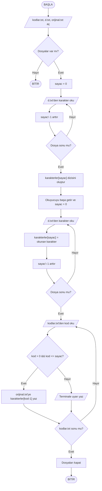

# Askeri Şifreleme (2. Şube - 4. Grup Dönem Sonu Projesi)

### Projenin Konusu
Projemizin konusu istenilen şifrelemeye göre verilen metin içerisindeki ilgili karakterlerin alınarak orijinal.txt adında yeni bir dosya içerisine yazılmasıdır. Şifreleme için gerekli girdiler sırası ile d.txt adında bir ilk metin ve kodlar.txt adında kodları içeren ikinci bir metin dosyasıdır. Proje tanımının tam hâli aşağıdaki görseldedir:


### Görev dağılımı
- **Aliberk Sandıkçı** - Proje koordinasyonu
- **Kaan Gülcan** - Genel kod yapısının C dilinde koda dökülmesi
- **Mehmet Çelik** - Akış diyagramının oluşturulması  
- Hepimiz - Kodun test edilmesi ve sunum


Projemizin işleyişini görselleştiren sözde kod ve akış diyagramı aşağıda verilmiştir. 

### Sözde Kod

```md
1. BAŞLA
2. kodlar.txt, d.txt ve orijinal.txt dosyasını aç
3. dosyaların varlığını kontrol et
4. sayac = 0 ata
5. d.txt'den bir karakter oku
  5.1. sayac'ı 1 arttır.
  5.2. Eğer d.txt dosyasının sonuna gelmediysen 5. adıma git, geldiysen 6. adımdan devam et
6. karakterler[sayac] seklinde bir dizi olustur
7. okuyucuyu satır başına getir
8. sayac = 0 ata
9. d.txt'den bir karakter oku
  9.1. okunan karakteri, karakterler[sayac]'e ata
  9.2. sayac'ı 1 arttır.
  9.3. Eğer d.txt dosyasının sonuna gelmediysen 9. adıma git, geldiysen 10. adımdan devam et
10. kodlar.txt'den bir sayı oku ve kod değişkenine ata
  10.1. "kod > 0 && kod <= sayac" ise 10.1.1. değilse 10.1.2. adımından devam et
    10.1.1. orijinal.txt dosyasına karakterler[kod-1] yaz
    10.1.2. indisin istenen aralıkta olmadığı ile ilgili terminale uyarı yaz
  10.2 kodlar.txt dosyasının sonuna gelmediysen 10. adıma atla. Geldiysen 11. adımdan devam et
11. Açılan dosyaları kapat
12. BİTİR
```




### Örnek Ekran Çıktıları
Projemizin çalışma zamanındaki örnek girdileri ve ekran çıktıları görsel olarak verilmiştir.

<br>
<br>
<br>
<br>

### C Program Kodları
Kodlara [main.c](https://github.com/KaanGulcan/2.sube-4.grup-proje/blob/main/main.c) dosyasından ulaşabilirsiniz

### GitHub

